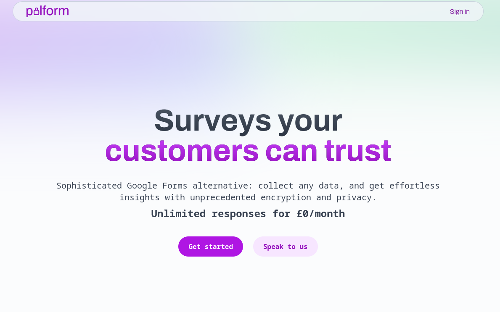
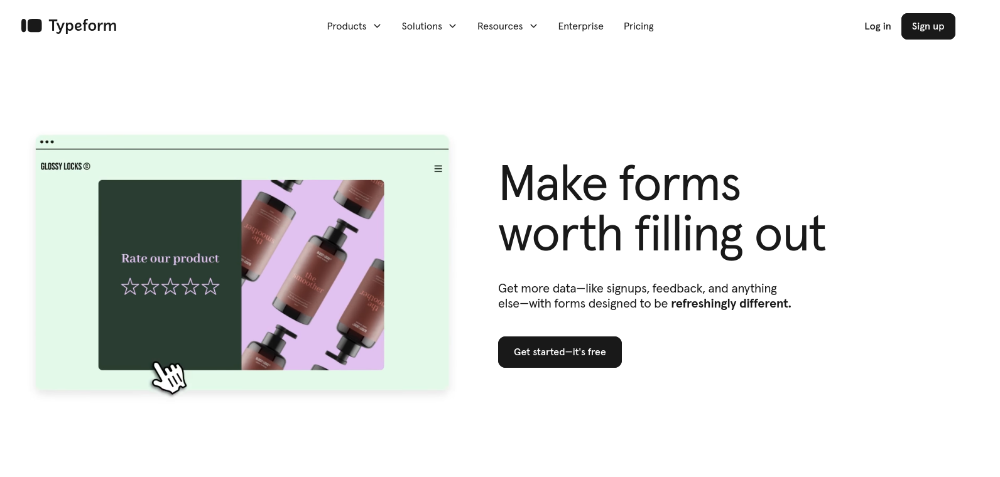
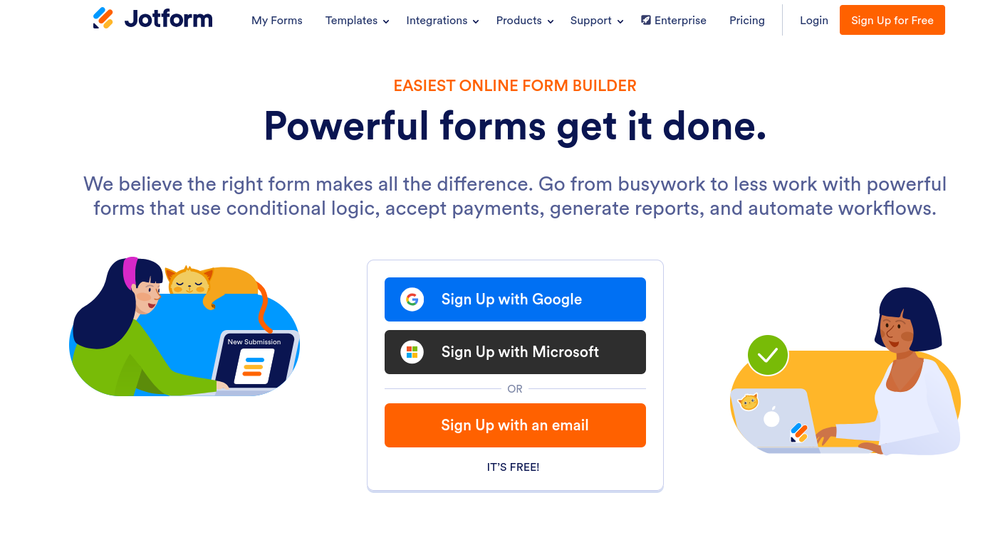
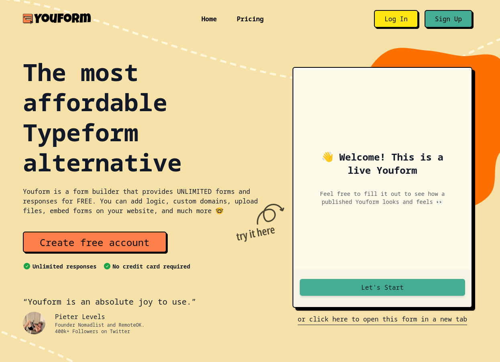
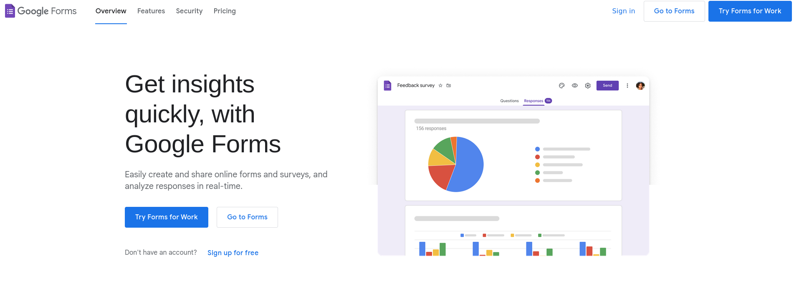
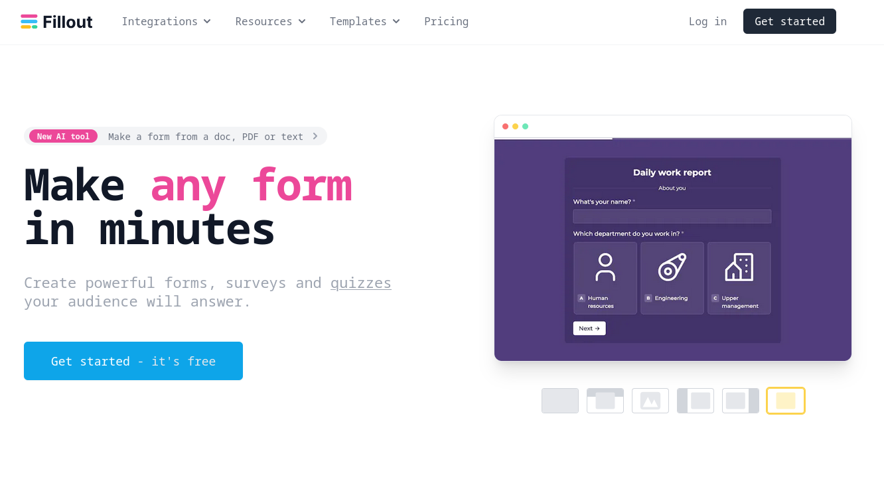
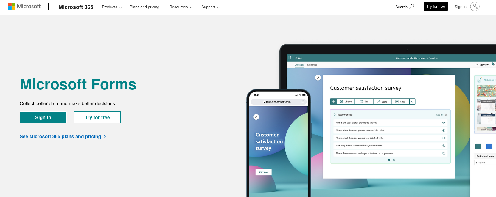

# The 7 best form builders in 2024

It's a hotly contested topic, and everyone has their own personal opinions! In the end, it boils down to what your use case is, who's filling out the forms, and how many responses you're expecting. Different form builders serve vastly different niches, and it's important to understand the differences.

<!-- truncate-->

We'll keep it nice and brief: having researched dozens of competing services in this _very_ crowded market, I've selected the best options. Most other comparison sites agree on most of these services.

:::info
This content is written for **Palform**, one of the mentioned form builders. We'll try to keep the article neutral, but keep in mind we might be biased!

We've researched the content on September 2nd, so it may have become inaccurate since then.
:::

## [Palform](https://palform.app)

A strong new player in the field, Palform places a special focus on privacy and security. It uses sophisticated **end-to-end encryption** technology, while also having the full range of features and simplicity you'd expect of any other form builder. It's also fully open source!

However, due to it's young status and thorough encryption, the range of 3rd-party integrations is limited, with email/webhook being the only currently available options.

More features [are being developed](/roadmap) constantly.

### Best for
- Showing your customers they can trust you.
  - The higher security guarantees let form-fillers know their data is safe, and places your reputation ahead of your competitors'
- Handling any kind of sensitive data
- Users experienced with Google or Microsoft Forms, and wanting an easy-to-use solution with no coding
- Generating beautiful actionable reports without any stats knowledge
- Cases where open-source software is a must
- Saving money

### Pricing
- **Unlimited responses** included in the free plan
- Higher plans up to ~$80/m have more features, e.g. for corporate compliance
- Discounted pricing offered for students and non-profits

## [Typeform](https://www.typeform.com/)

A long-running and controversial option, Typeform popularised the "one question at a time" way of doing forms. It features easy-to-build aesthetic designs and slick animations, as well as powerful data analyses.

However, the animations and layout may be overwhelming and confusing for some users who are not super comfortable with technology. 

### Best for
- Forms that are more about the "experience" and where one-at-a-time questions make sense
- Very small expected response counts
- Environments where budget doesn't matter

### Pricing
Notoriously, the pricing is amongst the highest out of all form builders, with the free plan **only offering 10 responses/month**.

Even the Basic plan, for **21EUR/mo** only includes **100 response/month**.

Plans go up to 75EUR/mo for 10,000 responses and more advanced features.

## [Jotform](https://www.jotform.com/)
A versatile, tried-and-test form builder, Jotform is capable of building forms in loads of different designs and layouts. The application is also very feature-rich, with extras such as PDF forms and built-in templates. E-signatures are also supported, with highly-rated 24/7 customer support.

It even supports encrypted forms, although in a much more lightweight and barebones way than the integrated experience offered by [Palform](https://palform.app).

### Best for
- Large enterprises needing compliance with strict standards such as HIPAA
- Users who are happy to plan to meet the complex pricing requirements
- Users wanting to save some time with pre-built templates

### Pricing
The free plan includes **100 submissions/month**, 10x more than Typeform. However, to continue beyond that, you need to pay **at least $34/mo** for the next plan.

Many, _many_ different values are limited by the plan specifications, including:

- Form submissions
- Form _views_
- Users
- Storage space
- _Stored_ submissions at a given time
- Fields per form
- E-signatures

If you need more of just one of these limits, you'll need to upgrade your plan, meaning it can get surprisingly expensive quite quickly.

However, it's definitely much better value-for-money than Typeform.

## [Youform](https://youform.com/)
A relatively new product, Youform has the same focus on simplicity as Palform, except targetting the Typeform one-question-at-a-time model.

It has a commendably ethical pricing model that makes planning your costs much simpler.

The design is very clean, and absolutely anyone can use it without experience.

Having tested it for a few days, the interface is genuinely very smooth and user friendly. The user reviews are right to sound so excited! Unlike most form builders though, the admin panel doesn't work on mobile. Checking your responses on the go is quite difficult sadly.

It lacks the ultra-high security and privacy guarantees of [Palform](https://palform.app).

### Best for
- People looking for a close Typeform alternative for a fraction of the price
- Simple use cases without high security guarantees
  - Data is hosted in the USA, so it might not be suitably GDPR compliant. But that's not legal advice!
- Saving money

### Pricing
Unlimited responses and most features for **free**, then $29/mo for further features.

## [Google Forms](https://www.google.com/forms/about/)
Ahhhh a good old classic. Google Forms continues to be the backbone of low-stakes data collection around the world.

The interface is really simple, and hasn't changed much over the years. As Google does not directly make any income from Google Forms, it's likely the development of new features isn't a huge priority. Customer support is also very limited or in most cases completely impossible.

Of course, as with all Google products, there are [serious data protection concerns](/blog/2024/08/27/secure-your-forms). Your data might be stored in the US, making it essentially unusable for any commercial data handling in the EU unless you fulfill an extremely complicated and technical legal framework.

Generally, Google Forms don't really look professional anymore. If a business is seriously using them, it just screams "low effort". Fortunately, there's many alternatives that are just as easy to use but produce a far prettier result.

The question types are also somewhat limited, and the boolean branching rules are very primitive.

Okay. Sorry. That's enough roasting Google Forms. I'm sorry if you're a passionate fan. We can continue in peace now.

### Best for
- Very _very_ simple use cases between family and friends, or for small informal events.
- Cases where brand identity doesn't matter at all
- Cases where no personal data is being collected

### Pricing
The consumer version is **free**! With no meaningful limits beyond the Google Drive file upload limit.

[Google Workspace](https://workspace.google.com/pricing.html) (a paid service) includes a very slightly more advanced version, where you can set [data sovereignty constraints](https://support.google.com/a/answer/14310028?hl=en) so that you can legally handle the personal data of EU citizens.

## [Fillout](https://www.fillout.com/)
Another tool similar to Jotform, Fillout creates pretty, mobile-friendly forms of any shape and size. Unlike most competitors, it also supports real-time collaboration, making it particularly suitable for teams working together on authoring forms.

It also comes with advanced tangential features, such as event scheduling and payment, built right in.

### Best for
- Real-time collaboration
- Versatile designs within one app
  - Instead of a Typeform-style app and Google-style app separately, Fillout can do both
- Building more complex automated pipelines involving your forms using integrations

### Pricing
- Generous free plan with most features included, and **up to 1000 responses/month**
- Plans with increasing response limits and more features
- For **$75/month** you get _unlimited_ responses

## [Microsoft Forms](https://www.microsoft.com/en-gb/microsoft-365/online-surveys-polls-quizzes)
Another classic, Microsoft's flagship data collection service actually keeps surprising. Unlike Google, new features are constantly added to this, such as the new AI-generated question suggestions.

The design can feel clunky occasionally (that's a personal opinion) and the loading times are often slow (both on the editing and filling side), especially if signing in with a Microsoft account is required.

Despite that, it's fairly easy to make good-looking forms, and it even features decently rich branching rules and question types. Still, lots of obvious genuinely useful types, such as address auto-complete inputs, are missing. But it's great to see that a product that has mostly non-paying users is still developed so actively!

And again, similarly to Google, Microsoft is an enormous ad-tech corporation. They haven't always been reliable with handling personal data, and employers using certain Office 365 plans get wide-ranging [worker surveillance powers](https://www.computerweekly.com/news/252521757/Microsoft-Office-365-has-ability-to-spy-on-workers).

Similarly to Google Forms, the data location is a bit of a pain point which makes targetting EU customers very tricky. Unless you're an EU-based Microsoft 365 customer, your Forms data [will be stored in the US](https://learn.microsoft.com/en-us/microsoft-365/enterprise/m365-dr-workload-other?view=o365-worldwide#forms) (or Australia if you're based there). That might mean any EU user who fills in your form will have their data transferred to the US without their explicit knowledge or consent, which could be a GDPR violation.

### Best for
- Large corporations wanting to keep all their data within Microsoft 365
- Similar simple use cases as Google Forms
- Speedy form writing with AI-generated questions

### Pricing
- Responses always **essentially unlimited**
  - The limit is defined by the amount of cloud storage space your account has
- Free for personal use
- Available on all paid Microsoft 365 plans, starting at **$6/user/month**
  - Most other form builders don't use a per-user pricing model; Microsoft does, as it's part of a wider office suite package. It's not currently possible to purchase a Forms subscription separately.

---

## Pricing overview
Response limits are the most common billing model for commercial form builders. In this table, we compare the reviewed form builders and their limit vs price value.

The values in this table are based on annual plans in USD.

| **Form builder**    | **Responses for free** | **Cheapest paid plan; included responses** | **Most expensive plan; included responses** |
|---------------------|------------------------|--------------------------------------------|---------------------------------------------|
| **Palform**         | Unlimited              | $5/month; unlimited                        | $83/month; unlimited                        |
| **Typeform**        | 10/month               | $23/month; 100/month                       | $83/month; 10,000/month                     |
| **Jotform**         | 100/month              | $34/month; 1,000/month                     | $49/month; 5,000/month                      |
| **Youform**         | Unlimited              | $29/month; unlimited                       | $29/month; unlimited                        |
| **Google Forms**    | Unlimited              | $6/user/month; unlimited                   | $18/user/month; unlimited                   |
| **Fillout**         | 1,000/month            | $15/month; 2,000/month                     | $75/month; unlimited                        |
| **Microsoft Forms** | Unlimited              | $6/user/month; unlimited                   | $24/user/month; unlimited                   |

## So which one should I go with???

It depends. Sorry. There is no straightforward answer.

We can roughly categorise these 7 tools by use case:

- **General purpose**: use these for any non-trivial data collection, big or small
  - Palform, Youform, Fillout
  - These all have unlimited plans, making it easy to scale without having to worry about surprise charges
- **High security/privacy**: use these when you're collecting sensitive data, such as medical or financial information
  - Palform
- **Low-stakes informal surveys**
  - Microsoft Forms and Google Forms
- **Advanced automation**
  - Jotform, Fillout
- **Beautiful, flashy, animated design**
  - Typeform

This is not exhaustive, and a lot of these form builders are versatile enough to be used for different use cases! I hope this guide gave you a decent insight into the world of form builders, and what to look for when choosing one.

My best advice is this: go out and try them! All of these services have free trials: make a MVP form that replicates whatever form you're actually intending to build, and see how easy the process is.

---
> Thanks for reading! If you have any questions about data collection or forms, feel free to send me an email! I'm happy to discuss and advise your problem, even if you're using other form builders.

> Email: pal@palform.app

> Follow [Palform on Linkedin](https://www.linkedin.com/company/palform/) to keep up to date with our helpful articles and resources!
