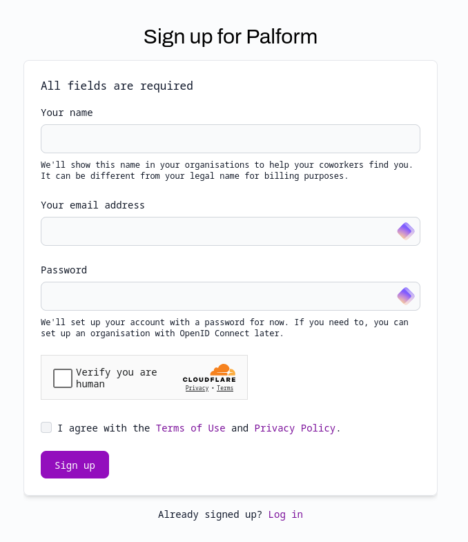

# Create an account

Making an account on Palform is really easy.

Simply head to [our sign up page](https://dash.palform.app/auth/signup) and fill in the simple details.

## What email address should I use?

Make sure your email address is a real, publicly-accessible address. You'll need to verify it by clicking on a link we'll send. You won't be able to use your account without verifying your email address.

We'll _never_ send any sort of marketing materials to you. We may occasionally send legally-required updates, such as changes to our Terms of Use, or notifications of significant activity occurring in your account.

## I want to use OpenID Connect

You'll still need to enter a password now, even if you already know you want to use OpenID Connect (available in our Business plan).
You'll be able to configure OIDC later once you've upgraded, and then your password will be deactivated.

This can be a complex process, so feel free to email us and we'll help you through the setup process.

## I haven't received a verification email

Please email us at hey@palform.app from the email you used to sign up, and we'll verify you manually.
