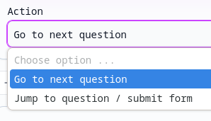
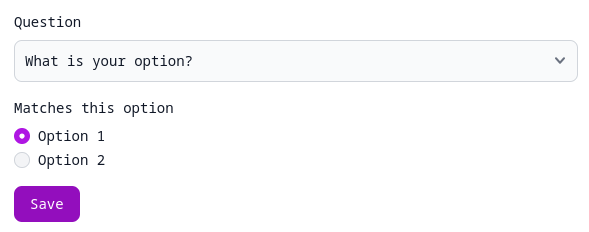

# Branching

You can use branching to send the user to different questions depending on their responses. This is useful for building interactive experiences and showing users only the questions they need to see, thereby maximising engagement.

:::info
Check out [our demo](https://pf.palform.app/one-at-a-time) of a form with branching enabled.
:::

## Create jump cases
Branching rules can be applied to sections in multiple-questions-per-page forms, or questions in one-question-at-a-time forms.

By default, all sections/questions are created with the "_Go to next section/question_" action. This means users will simply proceed to the next sequential section or question with no conditional logic.

To change this, select "_Jump to section/question / submit form_":

Now, you'll be able to add **jump cases**. A jump case consists of:

- A section/question to jump to, or alternatively the option to submit the form
- A list of conditions
- A boolean operator: either "All of" or "One of". For example, if "All of" is selected, all of the conditions must be true for the case to match.

By default, if you have no jump cases, the form will be submitted upon completion of the section/question. This will also be the case if no cases match.

A **condition** identifies the value of a certain question within the section. The definition of "value" differs between [question types](../questions). For example, with a "Choice" question, you'll be able to specify which option the user will need to have chosen for the condition to be true:

:::info
If there are no conditions inside a jump case, it will always match. You can use this if you want to always jump to a specific question, for example.
:::

## Behaviour with multiple jump cases
There's no limit to how many jump cases you can add to a section/question.

Jump cases will be combined with a boolean "OR" operation, starting from the top of the jump case list. If the first case doesn't match, the next one will be considered, and so on.

If the end of the list is reached and no cases have been matched, the default action will be to submit the form.

## Disabling branching
You can disable branching for a section/question by simply switching the action back to "Go to next question".
