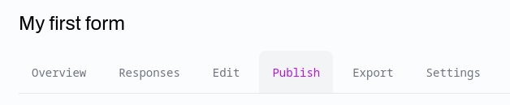
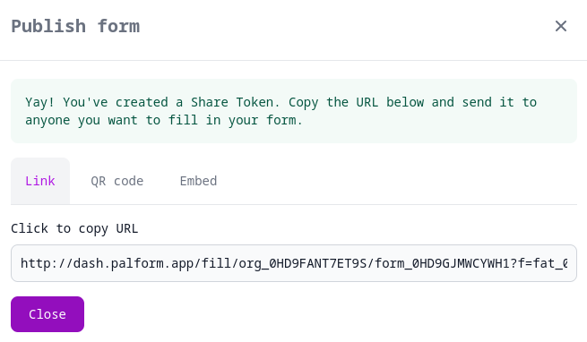

# Publishing

You can publish your form to let people with the link fill it in. Compared to other form builders, Palform has a more advanced publishing system, allowing you to create multiple links (known as Share Tokens) for each form with their own expiration dates and URLs.

## Publish a form

1. Select the "Publish" tab

    

2. Click "Publish form"

3. Enter the details you want. You can optionally set an expiration, meaning respondents won't be able to use that link to complete your form after that date.

    :::warning
    If you have multiple links for your form, respondents will still be able to use other non-expired links to complete it. The expiration date only applies to that individual link.
    :::

4. Click "Share!" and your Share Token will be created. You can select the format you need, and you can go back to those options afterwards, too. Users filling in your forms won't need to provide any sort of additional authentication, so make sure to only distribute this link to people who should have access.

    

## Delete a Share Token

1. Select the "Publish" tab

    

2. Find the Share Token you want to delete. In most cases, you'll probably just have one.

3. Click "Delete" on the row of the Token.
