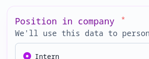

# Questions, sections, and content

In a Palform, all fields are referred to as **questions**, even if they're not actually asking the user anything (e.g. the Info and Hidden question types).

## Question types

Each question has a **type**, determining its behaviour, presentation, what kind of data it collects, its available conditions in branching rules, how it's presented in reports, how it behaves in correlation analysis, etc. A lot of this behaviour is quite opinionated to avoid having to configure complex options.

When you create a new question, you must choose its type. The type cannot be changed after creation, since all the data collected by that question will be in a specific format.

The following question types are available:

- Info
- Text
- Choice
- Choice matrix
- Scale
- Date
- Address
- Phone number
- File upload
- Signature
- Hidden

When creating a new question, a brief description explains what each type does. Some additional documentation is provided here for more complex question types.

### Hidden

This type takes in a value from a [query parameter](https://en.wikipedia.org/wiki/Query_string) at the end of the URL at which the form is being accessed, or the URL that was used to load the form into an iframe.

This can be helpful in bringing in external data related to the user. For example, consider the following flow:

- User schedules a call with your sales team
- Team sends user a Palform link to find out about their use case prior to the call, with a user ID in a query parameter
- User ID is captured by the hidden question, and sent along with the form response
- Sales team can see the response and immediately identify which user it's associated with, without the user having had to re-enter their details

When configuring the question, you can specify the name of the query parameter you want it to take data from.

For example, if you specify `user_id` as the value, it will take the value of the `?user_id=` parameter.

You can even use the hidden value in branching rules to show different questions to different users:


## Question anatomy

Questions are made up of a few component that define their behaviour and presentation.

### Title (required) and recall

Shown in a larger font, this is the actual question. You can write it either as a question ("What is your name?") or simply the data you want your users to input ("Name"). It's up to you!

Titles cannot contain special formatting (e.g. Markdown).

Titles can contain **recall tags**, referencing responses to other questions. To add a recall tag, use the syntax `{{internal_name}}` anywhere in the title, replacing `internal_name` with the [internal name](#internal-name) of the question who's response you want to reference.

For example:

```
Thanks {{first_name}}! How old are you?
```

The referenced question can be anywhere in the form, including after the referencing question.

If the referenced and referencing questions are on the same page, the title of the referencing question will update live as the user modifies the referenced question's value.

### Internal name

This is a reference to the question that's not shown visibly to end-users (although is technically accessible to them via API calls, so avoid including anything sensitive here).

This name can be refenced in [recall tags](#title-required-and-recall), the response table, and exports.

:::warning
To avoid character escaping issues, only alphanumeric characters (a-z, A-Z, 0-9) and underscores (\_) are allowed in internal names. They also cannot start with a number.
:::

### Description

Question descriptions are optional. If added, they support lightweight markdown editing and the inclusion of images, which will be responsively scaled automatically.

If you're new to Markdown, [check out this online tutorial](https://www.markdownguide.org/basic-syntax/). It's very easy to use!

To insert images, either:

- Find an image online, and include the URL using standard Markdown syntax:

  ```markdown
  
  ```

- Click the image icon in the editor, and choose an existing team asset

- Upload a new image by clicking the image icon, or dropping an image into the text editor. It will be added into your team (so it can be reused in other forms) and hosted on Palform's servers.

Descriptions are also available for the Info question type, meaning they can be used as extended descriptions, e.g. as the introduction to a research study.

### Required

If checked, the question will be marked as required with a red asterisk:



When filling in the form, it won't be allowed to pass the current section/page (or question for one-at-a-time forms) without having filled in that question.

Please keep in mind that, due to our end-to-end encryption, it's not possible to perform server-side validation of required questions. Although the web interface will prevent submitting a form with missing responses to required questions, it is technically possible to use the API to make a submission with missing responses.

## Sections

On multiple-questions-per-page forms, you can group questions into sections, which show up as distinct pages when the form is being filled in.

All questions within a section will be shown at once. By default, the form will progress from one section to the next linearly when the user clicks the "Next" button.

Sections by default are numbered sequentially, and the numbering is not displayed to users filling in forms. They can be given titles and descriptions optionally, which will then be shown to users at the top of the page.

Sections don't apply to one-question-at-a-time forms.
